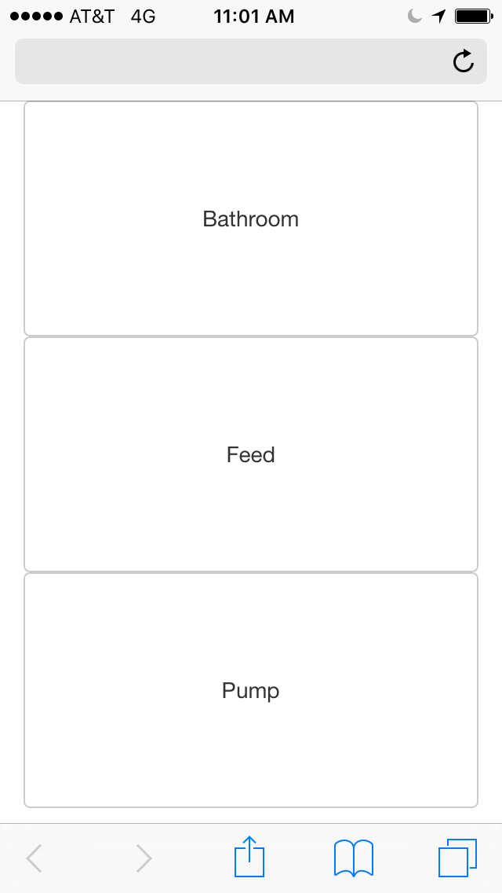
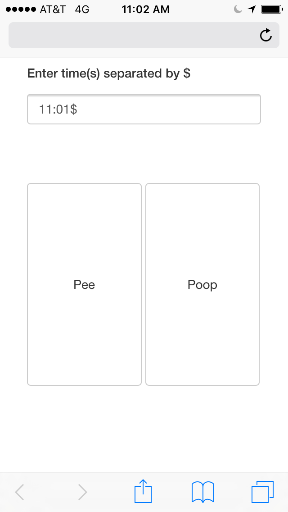
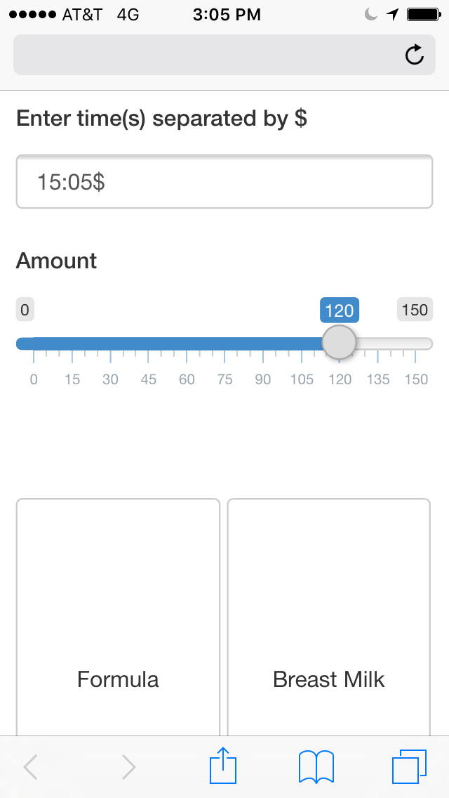
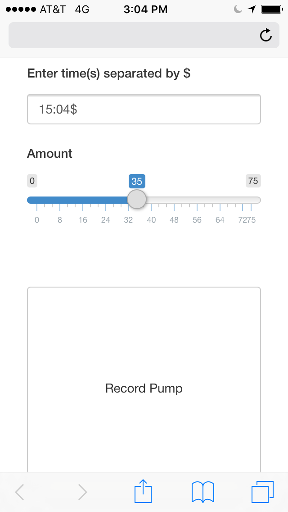
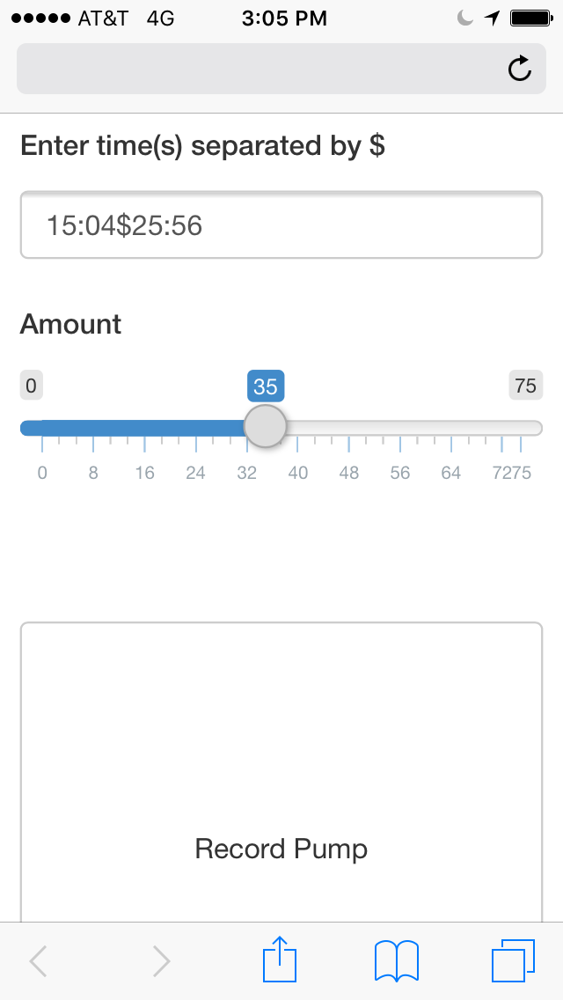
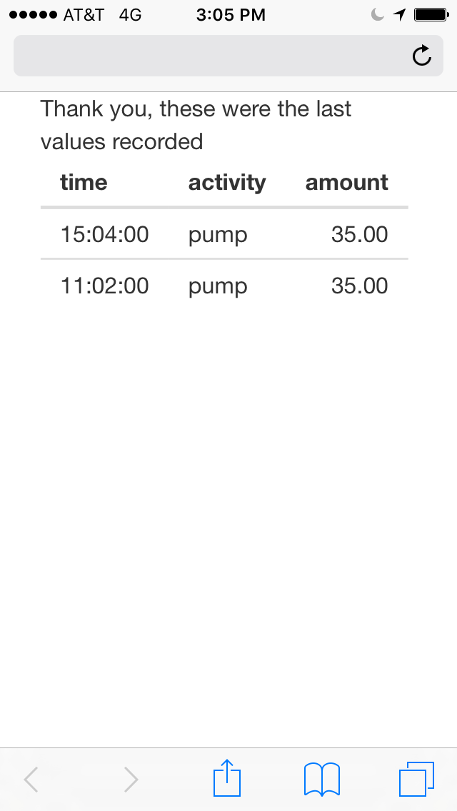

It didn't take long to realize that being able to track our newborns activities made life a whole lot easier. I for sure wanted the ability to export the data for future analysis, but this feature seemed limited to paid apps. Since I didn't want to put up the money for something I was interested in making anyways, I decided that I would skip the app store and make something custom that would fit our needs.

This process has evolved through a few iterations. First, we started with a simple spreadsheet that we would update every time something happened. The next step was to create a google form (which actually worked out pretty good for a while) but ultimately we decided to part ways. I was finally able to find some time to devote to sitting down and putting together the "final" product, which is below.

App must haves
--------------

1.  Since the ec2 instance my Shiny server sits on is on the weaker side of things I wanted to do most of the data manipulation outside the system. I've chosen to use SQL-Server on Azure because I know T-SQL the best and I have a free database on Azure thanks to an old .edu account.
2.  The app had to be simple to use. One of the issues with the google form was that entering the time value each iteration could be challenging on a small phone screen and got frustrating. I wanted the ability to auto populate the contents based on the current time/activity so that recording values was as simple as a few button clicks.
3.  It had to be able to handle multiple time inputs. When we pick up our child from daycare, we get a form that lists what times she was fed and used the bathroom throughout the day. Entering everything in bulk makes life a little easier.

### The application flow

<table style="border: none;">
<!-- Row 1- base -->
<tr style="border: none;">
<td width="30%" style="border: none;">
    This is the homepage of the app.  From here you can select one of the three options which
    will take you to one of the three pages below.

</td>
<td align="center" colspan="3" style="border: none;">

</td>
</tr>
<!-- Row 2 - arrows -->
<tr style="border: none;">
<td style="border: none;">
</td>
<td align="right" style="border: none;">

</td>
<td align="center" style="border: none;">

</td>
<td align="left" style="border: none;">

</td>
</tr>
<!-- Row 3 - 3 screens -->
<tr style="border: none;">
<td style="border: none;">
    This is where you enter the time(s) for the activity you want to record.  The textbox auto populates to the current time.  

</td>
<td align="center" style="border: none;">

</td>
<td align="center" style="border: none;">

</td>
<td align="center" style="border: none;">

</td>
</tr>
<!-- Row 4 - arrows -->
<tr style="border: none;">
<td style="border: none;">
</td>
<td style="border: none;">
</td>
<td style="border: none;">
</td>
<td align="left" style="border: none;">

</td>
</tr>
<!-- Row 5 - enter values -->
<tr style="border: none;">
<td style="border: none;">
Enter the value(s) if they are different from the current time and when you're ready to record hit the "Record Pump" button. A new row is created for each valid time in the text box.
</td>
<td align="center" colspan="3" style="border: none;">

</td>
</tr>
<!-- Row 6 - arrows -->
<tr style="border: none;">
<td style="border: none;">
</td>
<td style="border: none;">
</td>
<td align="center" style="border: none;">

</td>
<td style="border: none;">
</td>
</tr>
<!-- Row 7 - record -->
<tr style="border: none;">
<td style="border: none;">
To verify the data was entered correctly a final page is displayed containing the last n entries (n is equal to the number of time values you just tried to record). If the output returned is different from what you entered (example shown to the right) it is most likely that the insert failed due to an invalid time.
</td>
<td align="center" colspan="3" style="border: none;">

</td>
</tr>
</table>
This projoct is maintained [<u>here.</u>](https://github.com/mjholt02/babyTrackerUI)
